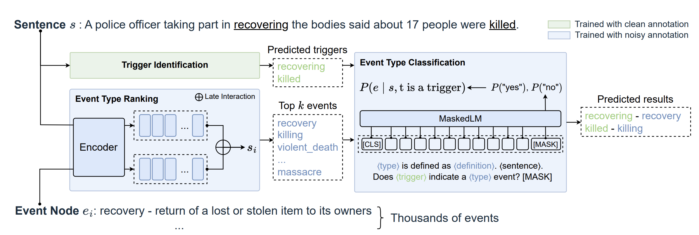

# GLEN: General-Purpose Event Detection
This repository contains the code of the paper titled ["GLEN: General-Purpose Event Detection for Thousands of Types"](https://arxiv.org/pdf/2303.09093.pdf).

## Data
- data
  - data_split
    - train.json
  - data_preprocessing.py
  - get_node_id.py
  - utils.py
  - xpo_glen.json

### Data Format
Each data file in ./data/data_split is in json format, which contain a list of data instances. The following examples include a training instance and a annotated test instance.
```json
{

}
```


## Model

Our model comprises three components:
- **Trigger Identification**: Identify potential triggers in the sentence
- **Type Ranking**: rank the top k possible event types for the sentence
- **Type Classification**: determine the best matching event type for each potential trigger
  
 

## Experiments
### Setup
- Install dependencies
```
    pip install -r requirements.txt
```

## Data Preprocessing


### Train
To train the different components of GLEN model, use 
```sh
bash scripts/run_trigger_detector.sh train ./data/tokenized_final_no_other 128 64 16 False wo_other_new_ontology
bash scripts/run_type_ranking.sh train 64 16 5 1e-5 se_id_new_loss_new_ontology -1 new_loss
bash scripts/run_event_trigger_matching_bts.sh train 32 64 5 1e-5 all_data_new_ontology -1
```

### Predict
To get the predicted results, use
```sh
bash scripts/run_trigger_detector.sh predict ./data/tokenized_final_no_other 128 32 64 False wo_other_new_ontology 4
bash scripts/run_type_ranking.sh predict 8 16 5 1e-5 se_id_new_loss_new_ontology -1 new_loss 4
bash scripts/run_event_trigger_matching_bts.sh predict 64 64 5 1e-5 all_data_new_ontology no_file -1 1
```